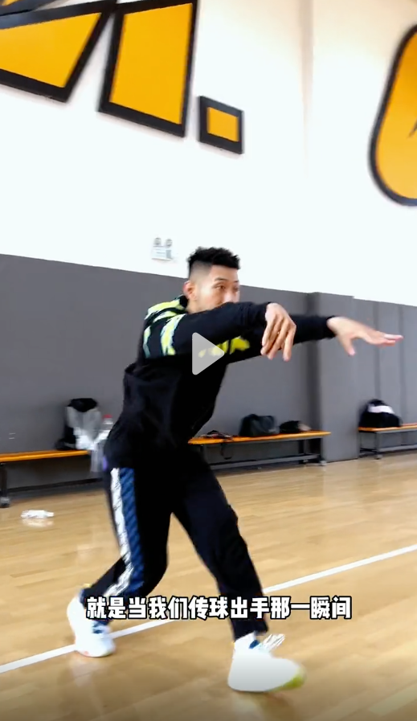

# 教程视频-传球

## 传球

<iframe height="500" width="100%" src="//player.bilibili.com/player.html?aid=474250071&bvid=BV1CK411S7Ap&cid=870004437&page=1" scrolling="no" border="0" frameborder="no" framespacing="0" allowfullscreen="true"> </iframe>

视频地址： https://www.bilibili.com/video/BV1CK411S7Ap

## 总结

1. 传球时，采用分脚站，然后后脚蹬地，把整个人往前送，把腿部力量发出去，这样传就会变得轻松
2. 传球的一瞬间，腿部发力，手指指向对方的胸口

