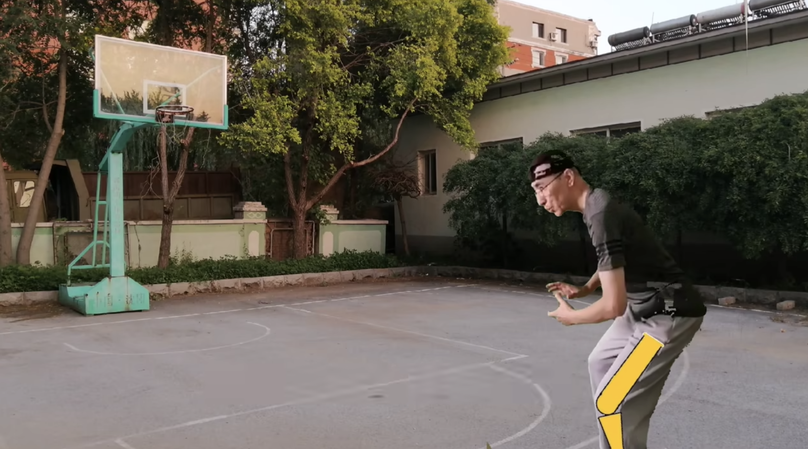

# 教程视频-屈髋

## 屈髋

### 视频

<iframe height="500" width="100%" src="//player.bilibili.com/player.html?aid=976146353&bvid=BV1X44y1x7cb&cid=429217634&page=1" scrolling="no" border="0" frameborder="no" framespacing="0" allowfullscreen="true"> </iframe>

视频地址 https://b23.tv/8Og7suc

### 总结

1. 先做习惯的合球动作
2. 重心后移，使小腿尽量垂直地面，膝关节尽量不超过脚尖
3. 不要先降重心，再屈髋，要在合球的同时就完成屈髋

